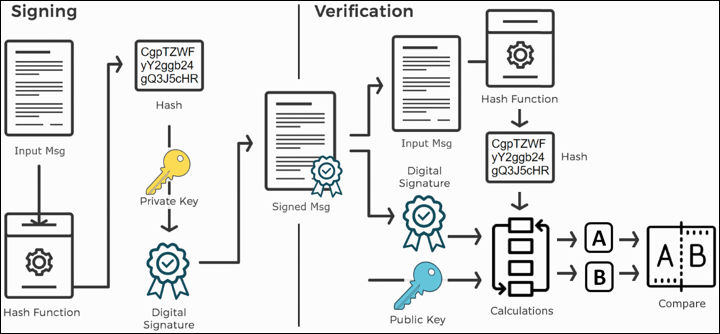
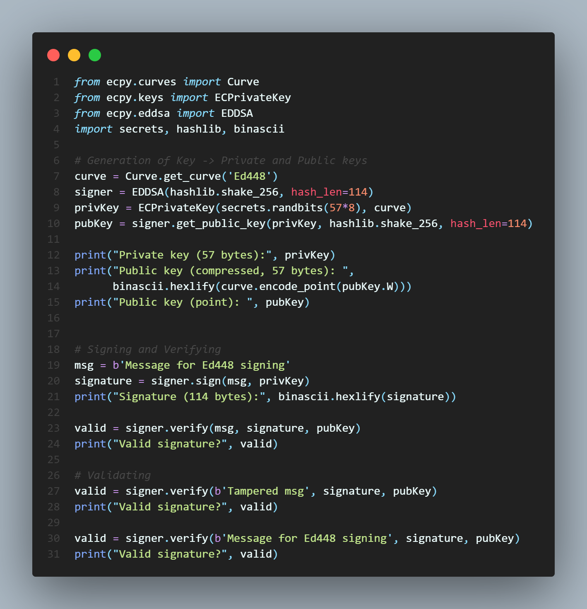
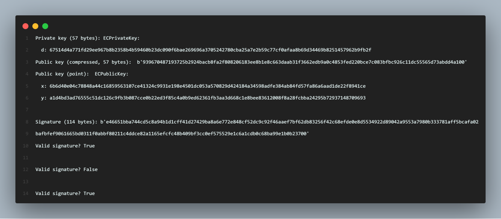

# Secure OTA updates

## Abstract

- Traditionally OEM’s used to recall the vehicles to update the firmware to introduce new features or to overcome unwanted bugs.
- This process not only consumes a lot of time but a bug can spoil the reputation of OEM.
- A better way to update the firmware is using OTA(over the air) updates which is reducing the dependency on the service station.
- But these updates should be securely encrypted and be computationally efficient.
- Therefore, an efficient system has to be designed which checks the firmware before updating onto the actual hardware/ECU.
- Thus, the proposed solution adds an extra layer of security to the ECUs to make sure the updates are secure.

## Solution

### Overview of the SIGNING and VERIFICATION process:

- 𝑠𝑖𝑔𝑛𝑀𝑠𝑔(𝑚𝑠𝑔, 𝑝𝑟𝑖𝑣𝐾𝑒𝑦)→𝑠𝑖𝑔𝑛𝑎𝑡𝑢𝑟𝑒
- 𝑣𝑒𝑟𝑖𝑓𝑦𝑀𝑠𝑔𝑆𝑖𝑔𝑛𝑎𝑡𝑢𝑟𝑒(𝑚𝑠𝑔, 𝑠𝑖𝑔𝑛𝑎𝑡𝑢𝑟𝑒, 𝑝𝑢𝑏𝐾𝑒𝑦)→𝑣𝑎𝑙𝑖𝑑 𝑜𝑟 𝑖𝑛𝑣𝑎𝑙𝑖𝑑

## Implementation

## Results

